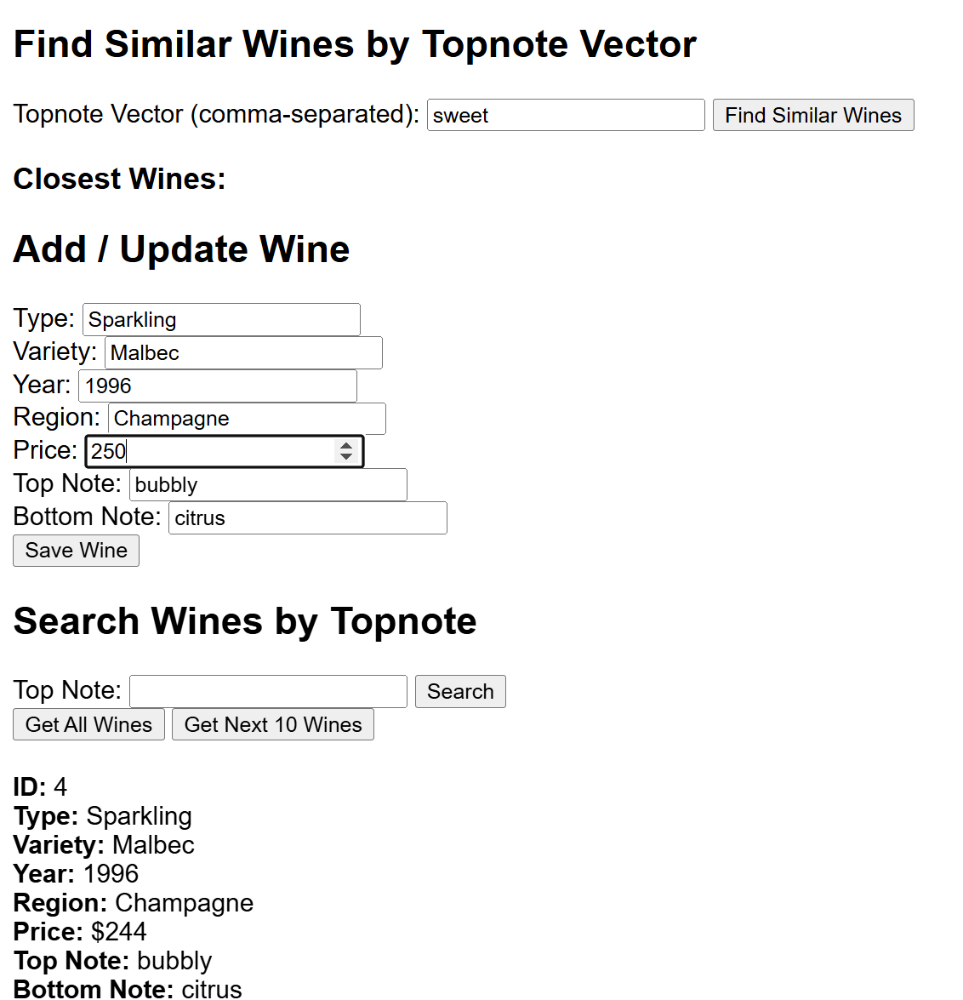

#repo
https://github.com/mulefish/mywinestore

# Tech stack? 
Backend: springboot, tombok, java 11, postgres
Frontend: simple html/js    
Technique: OneHot Digital vector search + cosign similarity  
 
# getting there
It compiles! 
But its vector search is not yet OK  

# Screenshot

